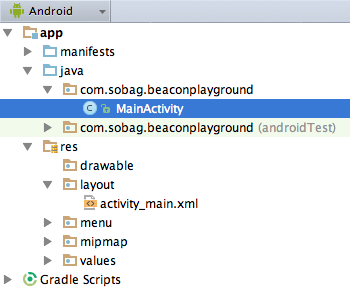

Android iBeacon Demo
======================

A simple code based tutorial enabling you to create your first Android iBeacon app!

The app will scan for iBeacons around you and display each Beacon contact in a list.

Project has been created with Android Studio 1.2 and has been tested on a Samsung Galaxy Note 3 phone.

# Setup project

We start by setting up an empty default project with a single generated out of the box Activity. Make sure to chose API Level 18 (Jelly Bean, Android 4.3.x) as BLE has been introduced pretty late.



# Prepare project

Ok cowboy...before we actually start coding, make sure you prepare your project (simply create a new default project with an empty activity) to support Bluetooth Low Energy scans, so open up your Androidmanifest.xml and add the following permissions:

```xml
<uses-permission android:name="android.permission.BLUETOOTH" />
<uses-permission android:name="android.permission.BLUETOOTH_ADMIN" />
```

Done...by so let's get our hands dirty!

# Implement Bluetooth Scan

## Define BLE Scan Callback

Before we start preparing our "super-sexy-iBeacon-ListView-User-Interface" we simply use some Log statements in order to make sure we detect iBeacons around us. So put an iBeacon close to your phone and add the following snippet to your *MainActivity.java*.

```java
// ------------------------------------------------------------------------
// Inner classes
// ------------------------------------------------------------------------

private BluetoothAdapter.LeScanCallback leScanCallback = new BluetoothAdapter.LeScanCallback()
{
    @Override
    public void onLeScan(final BluetoothDevice device, final int rssi, final byte[] scanRecord)
    {
        int startByte = 2;
        boolean patternFound = false;
        while (startByte <= 5)
        {
            if (    ((int) scanRecord[startByte + 2] & 0xff) == 0x02 && //Identifies an iBeacon
                    ((int) scanRecord[startByte + 3] & 0xff) == 0x15)
            { //Identifies correct data length
                patternFound = true;
                break;
            }
            startByte++;
        }

        if (patternFound)
        {
            //Convert to hex String
            byte[] uuidBytes = new byte[16];
            System.arraycopy(scanRecord, startByte + 4, uuidBytes, 0, 16);
            String hexString = bytesToHex(uuidBytes);

            //UUID detection
            String uuid =  hexString.substring(0,8) + "-" +
                    hexString.substring(8,12) + "-" +
                    hexString.substring(12,16) + "-" +
                    hexString.substring(16,20) + "-" +
                    hexString.substring(20,32);

            // major
            final int major = (scanRecord[startByte + 20] & 0xff) * 0x100 + (scanRecord[startByte + 21] & 0xff);

            // minor
            final int minor = (scanRecord[startByte + 22] & 0xff) * 0x100 + (scanRecord[startByte + 23] & 0xff);

            Log.i(LOG_TAG,"UUID: " +uuid + "\\nmajor: " +major +"\\nminor" +minor);
        }

    }
};

static final char[] hexArray = "0123456789ABCDEF".toCharArray();
private static String bytesToHex(byte[] bytes) {
    char[] hexChars = new char[bytes.length * 2];
    for ( int j = 0; j < bytes.length; j++ ) {
        int v = bytes[j] & 0xFF;
        hexChars[j * 2] = hexArray[v >>> 4];
        hexChars[j * 2 + 1] = hexArray[v & 0x0F];
    }
    return new String(hexChars);
}
```

So whats happening here? The inner class implements a callback handling a BLE-contact. Within this class there is a simple magic translating the byte[] scanRecord to human understandable values in terms of **UUID**,**major** and **minor** values - which then can be used by you. So simple...regarding the bytesToHex method: I'm not a Bytes-to-Hex-to-Bytes rocket scientist...simply asked Google for snippet in order to convert from Bytes to Hex and this snippet works like charm.

## Trigger BLE scan

Ok by now we have a callback enabling us to do "something" with the results of a scan - but actually we have to invoke the bluetooth scan in order to invoke the callback. So let's add some member variables enabling us to trigger bluetooth scan:

```java
private BluetoothManager btManager;
private BluetoothAdapter btAdapter;
private Handler scanHandler = new Handler();
private int scan_interval_ms = 5000;
private boolean isScanning = false;
```

Before we trigger the BLE scan it is important to have a basic understanding of BLE scans. Actually Android is pretty stupid regarding the BLE scan because the only thing you can do is to either scan or not scan. Scanning means: your device is searching for BLE signals around you...and searching for BLE devices means: massive loss of battery capacity! So you could head for an app doing continuous BLE scanning which will result in your phone shutting down after three hours or less. 

Or you put some brain power into the whole scanning process, a simple approach could be to define a duration for a scan intervall and simply switch between scanning and non scanning based on this interval: 20 seconds scanning, 20 seconds break, 20 seconds scanning...etc. So lets implement the scanning like this, it is up to you to modify the scanning intervals covering your requirements.

```java
// ------------------------------------------------------------------------
// public usage
// ------------------------------------------------------------------------

private Runnable scanRunnable = new Runnable()
{
    @Override
    public void run() {

        if (isScanning)
        {
            if (btAdapter != null)
            {
                btAdapter.stopLeScan(leScanCallback);
            }
        }
        else
        {
            if (btAdapter != null)
            {
                btAdapter.startLeScan(leScanCallback);
            }
        }

        isScanning = !isScanning;

        scanHandler.postDelayed(this, scan_interval_ms);
    }
};
```
...and finally int and trigger the BLE scan in your onCreate method...

```java
@Override
protected void onCreate(Bundle savedInstanceState)
{
    super.onCreate(savedInstanceState);
    setContentView(R.layout.activity_main);

    // init BLE
    btManager = (BluetoothManager)getSystemService(Context.BLUETOOTH_SERVICE);
    btAdapter = btManager.getAdapter();

    scanHandler.post(scanRunnable);
}
```

Done! By now you should see your beacons listed in your application logs:

```text
04-16 11:26:25.037  23701-23712/com.sobag.beaconplayground I/MainActivity﹕ UUID: B9407F30-F5F8-466E-AFF9-25556B57FE6D\nmajor: 31645\nminor30982
04-16 11:26:25.287  23701-23712/com.sobag.beaconplayground I/MainActivity﹕ UUID: B9407F30-F5F8-466E-AFF9-25556B57FE6D\nmajor: 3921\nminor5910
04-16 11:26:25.417  23701-23712/com.sobag.beaconplayground I/MainActivity﹕ UUID: B9407F30-F5F8-466E-AFF9-25556B57FE6D\nmajor: 7641\nminor40036
04-16 11:26:25.457  23701-23712/com.sobag.beaconplayground I/MainActivity﹕ UUID: F2C838F4-683C-4A21-AA5F-E5E98F17B76C\nmajor: 30228\nminor667
04-16 11:26:25.557  23701-23712/com.sobag.beaconplayground I/MainActivity﹕ UUID: F2C838F4-683C-4A21-AA5F-E5E98F17B76C\nmajor: 30228\nminor667
04-16 11:26:25.787  23701-23712/com.sobag.beaconplayground I/MainActivity﹕ UUID: B9407F30-F5F8-466E-AFF9-25556B57FE6D\nmajor: 14107\nminor24290
```

